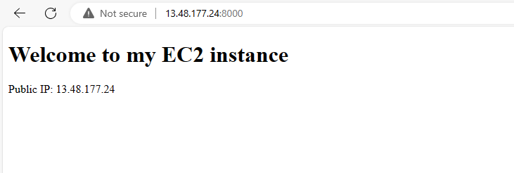
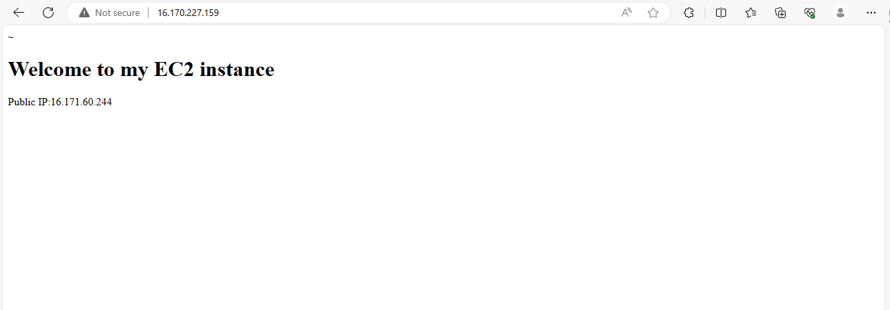

# Automating Loadbalancer Configuration with Shell Scripting

Streamline your load balancer configuration with ease using shell scripting and simple CI/CD on Jenkins. This project demonstrates how to automate the setup and maintenance of your load balancer using a freestyle job, enhancing efficiency and reducing manual effort.

# Automate the Deployment of Webservers

## Automate the Deployment of Webservers

In the implementing load balancer with Nginx course, We deployed two backend servers, with a load balancer distributing traffic accross the webservers. We did that by typing commands right on out terminal

In this course we will be automating the entire process. we will do that by writing a shell script that when ran, all that will did manually will be done for us automatically. As DevOps Engineers automation is at the heart of the work we do. Automation helps us speed the deployment of services and reduce the chance of making errors in our day to day activity.

This course will give a great introduction to automation.

## Deploying and configuring the Webservers

All the process we need to deploy our webservers has been codified in the shell script below:

`#!/bin/bash`

####################################################################################################################
##### `This automates the installation and configuring of apache webserver to listen on port 8000`
##### `Usage: Call the script and pass in the Public_IP of your EC2 instance as the first argument as shown below:`
######## `./install_configure_apache.sh 127.0.0.1`
####################################################################################################################

`set -x # debug mode`
`set -e # exit the script if there is an error`
`set -o pipefail # exit the script when there is a pipe failure`

`PUBLIC_IP=$1`

`[ -z "${PUBLIC_IP}" ] && echo "Please pass the public IP of your EC2 instance as an argument to the script" && exit 1`

`sudo apt update -y &&  sudo apt install apache2 -y`

`sudo systemctl status apache2`

`if [[ $? -eq 0 ]]; then`
####    `sudo chmod 777 /etc/apache2/ports.conf`
####   `echo "Listen 8000" >> /etc/apache2/ports.conf`
   ` sudo chmod 777 -R /etc/apache2/`

    sudo sed -i 's/<VirtualHost \*:80>/<VirtualHost *:8000>/' /etc/apache2/sites-available/000-default.conf

`fi`
#### `sudo chmod 777 -R /var/www/`
#### `echo "<!DOCTYPE html>`
        <html>
        <head>
            <title>My EC2 Instance</title>
        </head>
        <body>
            <h1>Welcome to my EC2 instance</h1>
            
Public IP: "${PUBLIC_IP}"

        </body>
        </html>" > /var/www/html/index.html

`sudo systemctl restart apache2`

Follow the steps to run the script:

**STEP 1:** Provision an EC2 instance running on ubuntu 20.04.

**STEP 2:** Open the port 8000 to allow traffic from anywhere using the security group

**STEP 3:** Connect to the webserver via the terminal using SSH client.

**STEP 4:** Open a file, paste the script above and close the file using the command below:

` sudo vi install.sh`

to close the file, use the esc botton then type :wqa!

**STEP 5:** Change the permission of the file to make it executable using the command below:

`sudo chmod +x install.sh`

**STEP 6:** Run the shell script using the command below. Make sure you read the instruction in the shell script to  learn how to use it.

`./install.sh PUBLIC_IP`

which is:

`./install.sh 16.171.143.21`

`./install.sh 13.48.177.24`

## DEPLOYMENT OF NGINX AS A LOAD BALANCER USING SHELL SCRIPT

### Automate the Deployment of nginx as a Load balancer using shell script

Having sucessfully deployed and configured two webservers, we will move on to the load balancer, as a prerequisite, we need to provision an EC2 instance running ubuntu 22.04, open port 80 to anywhere using the security group and connect to the load balancer via the terminal.

## Deployment and configuring Nginx load Balancer

### Deploying and Configuring Nginx Load Balancer

All the steps followed in the implementing Load Balancer with nginx course has been codified in the script below:

Read the instructions carefully in the script to learn how to use the script.

`#!/bin/bash`

######################################################################################################################

`##### This automates the configuration of Nginx to act as a load balancer`

`##### Usage: The script is called with 3 command line arguments. The public IP of the EC2 instance where Nginx is installed`

`##### the webserver urls for which the load balancer distributes traffic. An example of how to call the script is shown below:`

`##### ./configure_nginx_loadbalancer.sh PUBLIC_IP Webserver-1 Webserver-2`

`#####  ./configure_nginx_loadbalancer.sh 127.0.0.1 192.2.4.6:8000  192.32.5.8:8000`
############################################################################################################# 

`PUBLIC_IP=$1`

`firstWebserver=$2`

`secondWebserver=$3`

`[ -z "${PUBLIC_IP}" ] && echo "Please pass the Public IP of your EC2 instance as the argument to the script" && exit 1`

`[ -z "${firstWebserver}" ] && echo "Please pass the Public IP together with its port number in this format: 127.0.0.1:8000 as the second argument to the script" && exit 1`

`[ -z "${secondWebserver}" ] && echo "Please pass the Public IP together with its port number in this format: 127.0.0.1:8000 as the third argument to the script" && exit 1`

`set -x # debug mode`

`set -e # exit the script if there is an error`

`set -o pipefail # exit the script when there is a pipe failure`

`sudo apt update -y && sudo apt install nginx -y`

`sudo systemctl status nginx`

`if [[ $? -eq 0 ]]; then`

  `sudo touch /etc/nginx/conf.d/loadbalancer.conf`

 `sudo chmod 777 /etc/nginx/conf.d/loadbalancer.conf`

`sudo chmod 777 -R /etc/nginx/`
  
 `echo " upstream backend_servers {`

 ` # your are to replace the public IP and Port to that of your webserversserver  "${firstWebserver}"; # public IP and port for webserser 1 server "${secondWebserver}"; # public IP and port for webserver 2`

` }`

`server {`
         ` listen 80;`

 ` server_name "${PUBLIC_IP}";`

` location / {`

  `  proxy_pass http://backend_servers; `  

  ` }`

 `   } " > /etc/nginx/conf.d/loadbalancer.conf`

`fi`

`sudo nginx -t`

`sudo systemctl restart nginx`

## Steps to run the shell script

**Step 1:** On your terminal, open a file nginx.sh using the command below:

`sudo vi nginx.sh`

**Step 2:** Copy and Paste the script inside the file

**Step 3:** Close the file using the command below:

`type esc then shift + :wqa!`

**Step 4:** Change the file permission to make it an executable using the command below:

`sudo chmod +x nginx.sh`

**Step 5:** Run the script with the command below:

`./nginx.sh PUBLIC_IP Webserver-1 Webserver-2`

I run the script as:

`./nginx.sh 16.171.60.244 16.171.143.21 13.48.177.24`

## Verifying the setup

Screenshot for webserver one

Screenshot for webserver two

Screenshot for load balancer

**Congratulations!!!**

