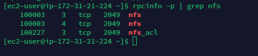

# DEVEOPS TOOLING WEBSITE SOLUTION

Embark on a journey to build a comprehensive DevOps tooling website solution in this project. Emplore the integration of various tools and technologies to create a unified platform that enhances collaboration, automation, and efficiency for software development and operations teams.

In this project, I will implement a solution that consist of following components:

1. **Infrastructure:** AWS

2. **Webserver Linux:** Red Hat Enterprises Linux 9

3. **Database Server:** Ubuntu 20.04 + MySQL

4. **Storage Server:** Red Hat Enterprises Linux 8 + NFS Server

5. **Programming Language:** PHP

6. **Code Repository:** GitHub

On the diagram below, you can see a common pattern where several stateless Web Servers share a common database and also access the same files using `Network Files System (NFS)` as a shared file storage. Even though the NFs server might be located on a completely separate hardware -for Web servers it look like a local file system from where they can serve the same files.

its important to know what storage solution is suitable for what use cases, for this -you need to answer following questions: what data will be stored, in what format, how this data will be accessed, by whoom, from where, how frequently, etc. Based on this, you will be able to choose the right storage system for your solution.

## Implementating a business website using NFS for the backend file storage

**Step 1 -Prepare NFS Server**

1. Spin up a new EC2 instance with RHEL Linux 8 Operating System.

2. Based on your LvM experience from project 6, configure LVM on the server.

- Instead of formating the disks as `ext4`, you will have to format them as `xfs`

- Ensure there are 3 **Logical Volumes,** `lv-opt`  `lv-apps` and `lv-logs`

3. Create mount points on `/mnt` directory for the logical volumes as follow: Mount`lv-apps` on `/mnt/apps` -to be used by webservers Mount `lv-logs` on `/mnt/logs` -To be used by webserver logs Mount `lv-opt`on `/mnt/opt` -To be used by Jenkins server in Project 8

4. Install NFS server, configure it to start on reboot and make sure it is running.

`sudo yum -y update`

`sudo yum install nfs-utils -y`

`sudo systemctl start nfs-server.service`

`sudo systemctl enable nfs-server.service`

`sudo systemctl status nfs-server.service`

5. Export the mounts for webservers `subnet cidr` to connect as clients. For simplicitly, you will install your all three Web Servers inside the same subnet, but in production set up you would probably want to separate each tier inside its own subnet for higher level of security. To check your `subnet cidr` -open your EC2 details in AWS web console and locate Networking tab and open a Subnet link:

Make sure we set up permission that will allow our Web servers to read, write and execute files on NFS:

`sudo chown -R nobody: /mnt/apps`

`sudo chown -R nobody: /mnt/logs`

`sudo chown -R nobody: /mnt/opt`

`sudo chmod -R 777 /mnt/apps`

`sudo chmod -R 777 /mnt/logs`

`sudo chmod -R 777 /mnt/opt`

`sudo systemctl restart nfs-server.service`

Configure access to NFS for clients within the same subnet (example of Subnet CIDR-`172.31.16.0/20`):

`sudo vi /etc/exports`

`/mnt/apps <Subnet-CIDR>(rw,sync,no_all_squash,no_root_squash)`

`/mnt/logs <Subnet-CIDR>(rw,sync,no_all_squash,no_root_squash)`

`/mnt/opt <Subnet-CIDR>(rw,sync,no_all_squash,no_root_squash)`

`Esc + :wq!`

`sudo exportfs -arv`

6. Check which port is used by NFS and open it using Security Groups (add new Inbound Rule)

`rpcinfo -p | grep nfs`

**Important note: In order for NFS server to be accessible from your client, you must also open following ports: TCP 111, UDP 111, UDP 2049

## Configure backend database as part of 3 tier architecture

**Step 2 -Configure the database server**

By now you should know how to install and configure a MySQL DBMS to work with remote Web Server

1. Install MySQL server

2. Create a database and name it `tooling`

3. Create a database and name it `webaccess`

4. Grant permission to `webaccess` user on `tooling` database to do anything only from the webservers `subnet cidr`

**Step 3 -Prepare the Web Servers

We need to make sure that our Web Servers can serve the same content from shared storage solutions, in our case -NFS Server and MySQL database. You already know that one DB can be accessed for `reads` and `writes` by multiple clients. For storing shared files that our Web Servers will use -we will utilize NFS and mount previously created Logical Volume `lv-apps` to the folder where Apache stores files to be served to the users (`/var/www`).

During the next steps we will do the following:

- Configure NFS client (this step must be done on all three servers)

- Deploy a tooling application to our Web Servers into a shared NFS folder

- Configure the Web Servers to work with a single MySQL database

1. Launch a new EC2 instance with RHEL 8 Operating System

2. Install NFS client

`sudo yum install nfs-utils nfs4-acl-tools -y`

3. Mount `/var/www/` and target the NFS server's export for app

`sudo mkdir /var/www`

`sudo mount -t nfs -o rw,nosuid <NFS-Server-Private-IP-Address>:/mnt/apps /var/www`

4. Verify that NFS was mounted sucessfully by running `df -h`. Make sure that the changes will persist on Web Server after reboot:

`sudo vi /etc/fstab`

add following line

`<NFS-Server-Private-IP-Address>:/mnt/apps /var/www nfs defaults 0 0`

5. Install **Remi's repository** Apache and PHP

`sudo yum install httpd -y`

`sudo dnf install https://dl.fedoraproject.org/pub/epel/epel-release-latest-8.noarch.rpm`

`sudo dnf install dnf-utils http://rpms.remirepo.net/enterprise/remi-release-8.rpm`

`sudo dnf module reset php`

`sudo dnf module enable php:remi-7.4`

`sudo dnf install php php-opcache php-gd php-curl php-mysqlnd`

`sudo systemctl start php-fpm`

`sudo systemctl enable php-fpm`

`setsebool -P httpd_execmem 1`

**Repeat steps 1-5 for another 2 Web Servers

6. Verify that Apache filesand directories are available on the Web Server in `/var/www` and also on the NFS server in `/mnt/apps`. If you see the same files -it means NFS is mounted correctly. You can try to create a new file `touch test.txt` from one server and check if the same files is accessible from other Web Servers.

7. Locate the log folder for Apache on the Web Server and mount it to NFS server's export for logs. Repeat step No 4 to make sure the nount point will persist after reboot.

8. Fork the tooling cource code from Darey.io Github Account to your Github account.

9. Deploy the tooling website's code to the Web Server. Ensure that the **html** folder from the repository is deployed to `/var/www/html`

**Note 1:** Do not forget to open TCP port 80 on the webserver

**Note 2:** If you encounter 403 Error -check permission to your `/var/www/html` folder and also disable SELinux `sudo setenforcr 0` to make this change permanent -open following config `sudo vi /etc/syconfig/selinux` and set `SELINUX=disable`, then restart httpd.

10. Update the website's configuration to connect to the database (in `/var/www/html/functions.php`file). Apply `toolin-db.sql` script to your database using this command `mysql -h ,databse-private-ip> -u <db-username> -p <bd-pasword> <tooling-db.sql>`

11. Create in MySQL a new admin user with username: `myuser` and password: `password`;

`INSERT INTO 'users' ('id', 'username', 'password', 'email', 'user_type', 'status') VALUES`
`-> (1, 'myuser', '5f4dcc3b5aa765d61d8327deb882cf99', 'user@mail.com', 'admin', '1');`

12. Open the website in your browser `http://,web-Server-Public-IP-Adress-or-Public-DNS-Name>/index.php` and make sure you can login into the website with `myuser` user.

Congratulations!

You have implemented a web solution for a DevOps team using LAMP stack with remote Database and NFS servers.

