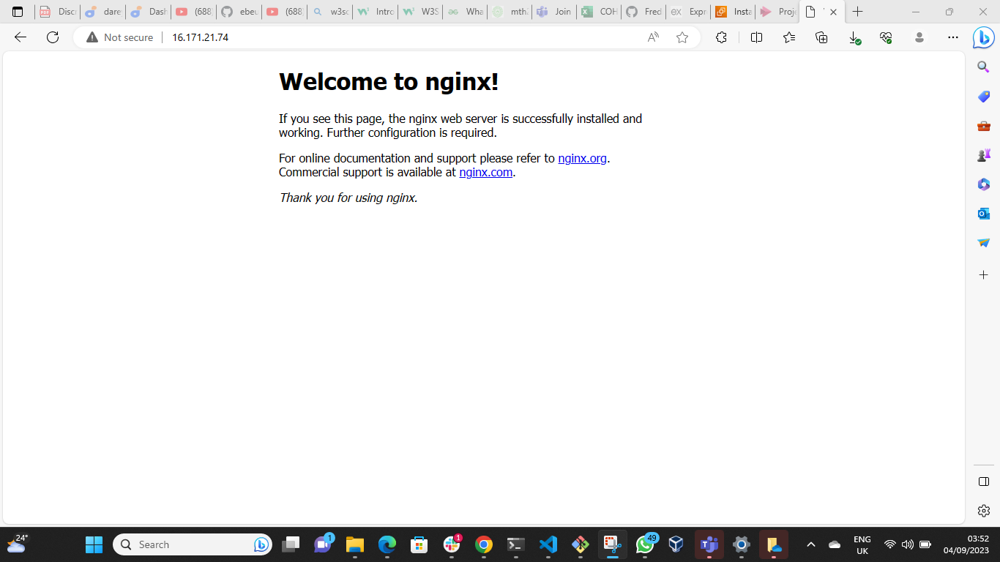
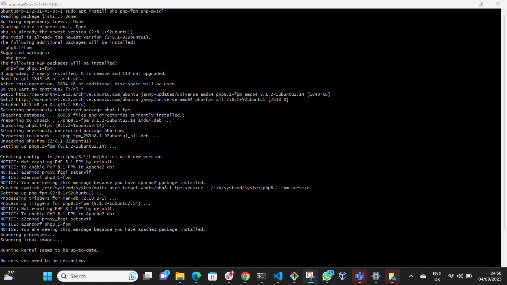
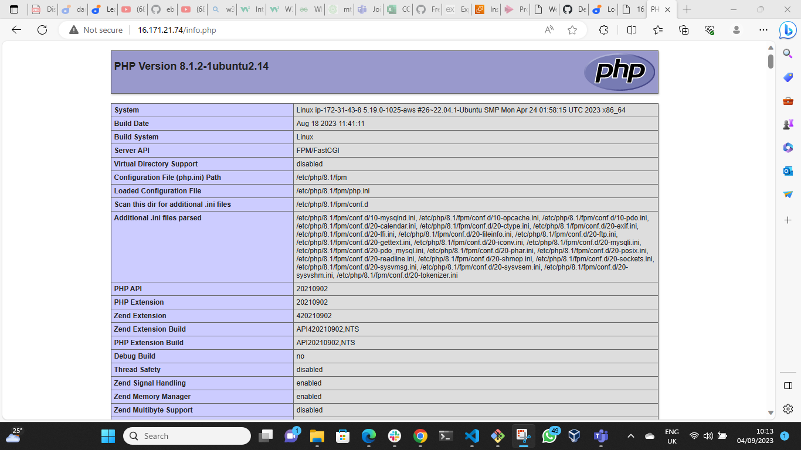

# LEMP STACK IMPLEMENTATION (Linux, Nginx, MySQL, PHP).

## Prerequisites

- Cloud Service Provider -AWS
- Launch a Linux Instance (Ubuntu preferably)
- Have a prior knowledge with basic `SQL syntax commands`, `vim` &  `Nano editor` and `commands`

First, we have to download and install Git bash in our local machine and running the following command.
- Note: Before running the command, we have to switch to the directory where our private ket is located.

`ssh -i <Your -private key> ubuntu@<EC2-Public-key-address>`

which in my case, it is 

`ssh -i git.pem ubuntu@16.171.21.74`

## STEP 1 - INSTALLING THE NGINX SERVER 

Install Nginx using Ubuntu's package manager 

`apt`

Update a list of packages in package manager

`sudo apt update`

Run nginx package installation

`sudo apt install nginx`

When prompted, confirm installation by typing Y, and then ENTER.

To verify that nginx is running as a server in your OS, use the following command

`sudo systemctl status nginx`

- Note: If it is green and running like the image below, then everything is okay.

To request our nginx on port 80, we have to use the `curl `command.

`curl http://localhost:80`

which in my case is 

`curl http://16.171.21.74:80`

To view the Nginx default page, Go to http://Public-IP-Address:80 in your browser

which in my case is 

http://16.171.21.74:80

## STEP 2 - INSTALLING MySQL

Again, use `apt` to acquire and install this software:

`sudo apt install mysql-server`

When prompted, confirm installation by typing Y, and then ENTER.

When the installation is finished, log in to MySQL console by typing:

`sudo mysql`

This will connect to MySQL server as the administrative database user root, which is inferred by the use of sudo when running this command.

Define the user password using the command

`ALTER USER 'root'@'localhost' IDENTIFIED WITH mysql_native_password BY 'PassWord'`

Exit the MySQL shell with

`mysql> exit`

Start the interactive script by running:

`sudo mysql_secure_installation`

This will ask if you want to configure the VALIDATE PASSWORD PLUGIN.

## STEP 3 - INSTALLING PHP

In addition to the php package, you will need `php-fpm`, which stand for PHP fastCGI process manager that tell Ngnix to to pass PHP request to the software for processing. Yow wo;; a;so need `php-mysql`, a PHP module that allows PHP to communicate with MySQL-based databases. Core `PHP` packages will automatically be installed as dependencies.

To install these 3 packages at once, run:

`sudo apt install php php-fpm php-mysql`

## STEP 4 - CONFIGURING NGINX TO USE PHP PROCESSOR

Create a server blocks (similar to virtual hosts in Apache) and use ProjectLamp as the domain name.

Create the root root weg directory of the domain name as follows:

`sudo mkdir /var/www/projectLEMP`

Next, assign ownership of the directory with the $USER environment variable, which will reference your current system user.

`sudo chown -R $USER:$USER /var/www/projectLEMP`

Then open a new configuration file in Nginx's `site-available `directory using your preferred command-line editor `nano `

 `sudo nano /etc/nginx/sites-available/projectLEMP`

 This will create a new blank file, paste in the following bare-bone configuration. 

 Here's what each directives and location blocks do:

 - `listen`: defines what port nginx will listen on. in this case, it will listen on port 80
 - `root`: defines the document root where the files served by thid website are stored.
 - `index`: defines in which order nginx will priortize index file for this website
 - `server_name`: defines which domain name and/or IP address the server block should respond for.
- `location / `: The first location block includes a `try_files` directive, which checks for the existence of files or directories matching a URI request.

- `location ~\.php$`: This location block handles the actual PHP processing by pointing Nginx to the fastcgi-php.conf configuration file and the `php7.4-fpm.sock file`, which declare what socket is associated with `php-fpm`.
- `location ~/\.ht`: The location block deals with `.htaccess` file, which nginx does not process. by adding these deny all directive, if any
`.htaccess` happen to find their way into the document root, they will not be served to visitor.

when you are done editing, save and close the file.

Activate the configuration by linking to the config file from Nginx `site-enabled` directory:

`sudo ln -s /etc/nginx/sites-available/projectLEMP /etc/nginx/sites-enabled/`

This will tell nginx to use the configuration next time its reloaded. you can test your configuration for syntax errors by:

`sudo nginx -t`

We also need to disable default Nginx host that is currently configured to listen on port 80 fot this run:

`sudo unlink /etc/nginx/sites-enabled/default`

Now, reload Nginx and apply the changes:

`sudo systemctl reload nginx`

Your new website is active, but the web root /var/www/projectLEMP is still empty. Create an index.html file in that location so that we can test that your server block works as expected.

`sudo echo 'Hello LEMP from hostname' $(curl -s http://169.254.169.254/latest/meta-data/public-hostname) 'with public IP' $(curl -s http://169.254.169.254/latest/meta-data/public-ipv4) > /var/www/projectLEMP/index.html`

Now go to your browser and try to open your website URL using IP address:

`http://<Public-IP-Address>:80`

which in my case is:

`http://16.171.21.74:80`

## STEP 5 - TESTING PHP WITH NGINX

You can do this by creating a test PHP file in your document root. Open a new file called `info.php` within your document root in your text editor:

`nano /var/www/projectLEMP/info.php`

Type and paste the following lines into the new file. This is valid PHP code that will return information about your server.

`<?php
phpinfo();`

You can now access this page in your web browser by visiting the domain name or public IP address you've set up in your Nginx configuration file followed by `/info.php`:

`http://'server_domain_or_IP'/info.php`

which in my case is:

`http://16.171.21.74/info.php`

You will see a web page containing detailed information about your server:

After checking the relevant information about your PHP server through that page, its best to remove the file you created as it contains sensitive information about your PHP environment and your Ubuntu server. You can use `rm `to remove that file:

`sudo rm /var/www/your_domain/info.php`

## STEP 6 - RETRIEVING DATA FROM MYSQL DATABASE WITH PHP.

First, connect to the MySQL console using the root account:

`sudo mysql`

Create a new database by running the following command from your MysQL console:

`mysql> CREATE DATABASE `example_database`;`

Now you can create a new user named `example_user`, usind mysql_native_password as default authentication method. we're defining this user's password as `Password.1`, but you should replace this valus with a secure password of your own choosing

`mysql>  CREATE USER 'example_user'@'%' IDENTIFIED WITH mysql_native_password BY 'PassWord.1';`

Now we need to give this user permission over the `example_database ` database.

mysql> `GRANT ALL ON example_database.* TO 'example_user'@'%';`

This will give the exampl_user full privilege over the example_database, while this user from creating or modifying other database on your server.

Now exit the MySQL shell with:

`mysql> exit`

Now you can test if the new user has proper permission by logging into the MySQL console again, this time using the custom user credentials:

`mysql -u example_user -p`

Notice the `-p` flag i this command, which prompt you for the password used when creating the `example_user` user. 

After logging in, confirm that you have access to the `example_database` database:

`mysql> SHOW DATABASES;`

This will give you the following output:

Next we create a test table named **todo_list**. From the MySQL console, run the following statement

`CREATE TABLE example_database.todo_list (item_id INT AUTO_INCREMENT,content VARCHAR(255),PRIMARY KEY(item_id));`

Insert a few rows of content in the test table. You might want to repeat the next command a few times, using different VALUES.

`mysql> INSERT INTO example_database.todo_list (content) VALUES ("My first important item");`

To confirm that the data was successfully saves to your table, run:

`mysql>  SELECT * FROM example_database.todo_list;`

You'II see the following output:

After confirming that you have valid data in your test table, you can exit the MySQL console:

`mysql> exit`

Now you can create a PHP script that will connect to MySQL and query for your content. Create a new PHP file in your custom web root directory using your preferred editor. we will use vi for that: 

`nano /var/www/projectLEMP/todo_list.php`

The following PHP script connect to the MySQL database and queries for the content of the **todo_list** table, display the results in a list,

Copy this content into your `todo_list.php` script

`<?php
$user = "example_user";
$password = "PassWord.1";
$database = "example_database";
$table = "todo_list";

try {
  $db = new PDO("mysql:host=localhost;dbname=$database", $user, $password); 
  echo "<h2>TODO</h2><ol>";
  foreach($db->query("SELECT content FROM $table") as $row) {
    echo "<li>" . $row['content'] . "</li>";
  }
  echo "</ol>";
} catch (PDOException $e) {
    print "Error!: " . $e->getMessage() . " ";
    die();
}
`

Save and close the file when you are done.

You can now access the page in your web browser by visiting the domain name or public IP address configured for your website:

`http://<Public_domain_or_IP>/todo_list.php`

which in my case is:

`http://16.171.21.74/todo_list.php`

You should see a page like this, showing the content you've inserted in your test table.

This means your PHP environment is ready to connect and interact with your MySQL server.

