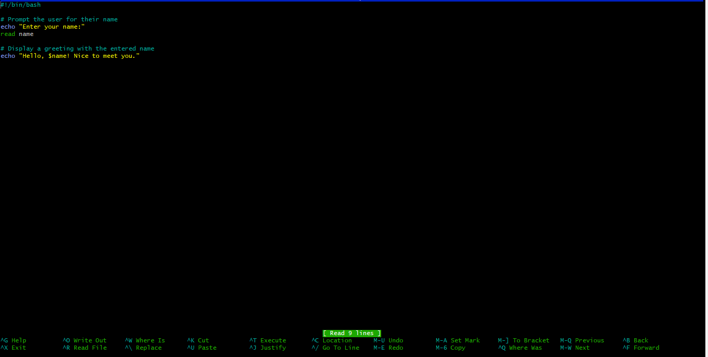
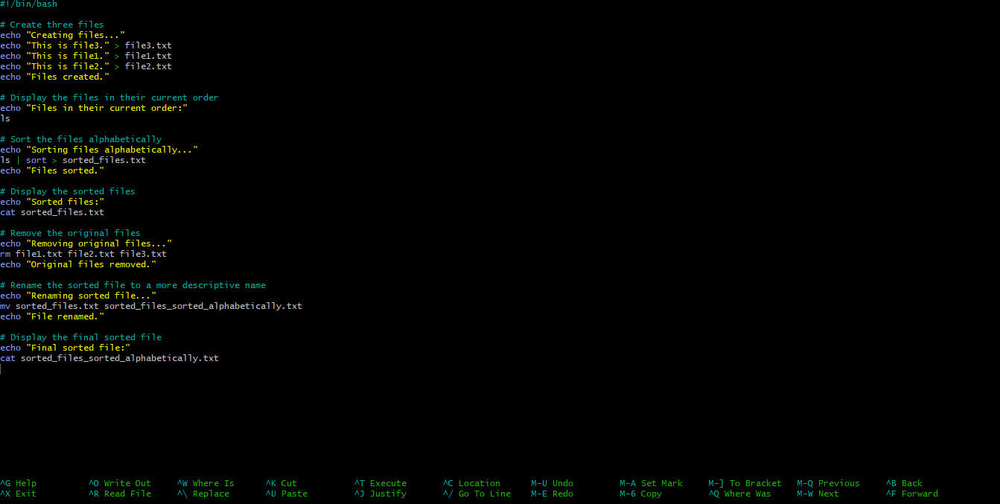

# INTRODUCTION TO SHELL SCRIPTING AND USER INPUT

## Shell Scripting syntax element

### 1. Variables 

Bash allows one to define and works with variables. Variables can store data of various types such as numbers, strings, and arrays. You can assign values to variables using the = operator, and access their values using the variable name preceded by a `$` sign.

#### Example -Assigning values to a variable:

`name= "John"`

#### Example -Retrieving valus from a variable:

 `echo $name`

 

### 2. Control Flow

Bash provides control flow statements like if -else, for loops, while loops, and case statements to control the flow of execution in your scripts. these statements allow you to make decisions, iterate over lists, and execute different commands based on conditions.

#### Example -using *if-else* to execute script based on a conditions

`#!/bin/bash`

`# Example script to check if a number is positive, negative, or zero`

`read -p "Enter a number: " num`

`if [ $num -gt 0 ]; then`

    `echo "The number is positive."`

`elif [ $num -lt 0 ]; then`

    `echo "The number is negative."`

`else`

    `echo "The number is zero."`

`fi`

The piece of code prompts you to type a number and prints a statement stating the number is positive or negative.

#### Example -Iterating through a list using a for loop

`#!/bin/bash`

`# Example script to print numbers from 1 to 5 using a for loop`

`for (( i=1; i<=5; i++ ))`

`do`

  `  echo $i`

`done`

The result is :

### 3. Command Substitution

It allows you to capture the output of a command and use it as a value within your script. You can use the backtick or the $()syntax for the command substitution.

#### Example -Using backtick for command substitution

`current_date=``date +%Y-%m-%d`

#### Example -Using `$()` syntax for command substitution.

`current_date=$(date +%Y-%m-%d)`

### 4. Input and Output

Bash provides various ways to handle input and output. You can use the read command to accept the user input, and output text to the console using the echo command. Additionally, you can redirect input and output using operators like > (output to a file), <(input from a file), and | (pipe the ouput of one command as input to another).

#### Example -Accept user input

`echo "Enter your name:"`

`read name`

#### Example -Output text to the terminal

`echo "Hello World"`

#### Example -Out the result of a command into a file

`echo "hello world" > index.txt`

#### Example -Pass the result of a command as input to another command.

`echo "hello world" | grep "pattern"`

### 5. Functions

Bash allows you to define and use functions to group related commands together. Functions provide a way to modularize your code and make it more reusable. You can define functions using the function keyword or simply by declaring the function name followed by a parenthesis.

`#!/bin/bash`

`# Define a function to greet the user`

`greet() {
    echo "Hello, $1! Nice to meet you."
}`

`# Call the greet function and pass the name as an argument`

`greet "John"`

## LET US WRITE OUR FIRST SCRIPT.

**step 1:** On your terminal, open a folder called *shell scripting* using the command `mkdir shell-scripting`. This will hold all the script we will write in this lesson.

**step 2:** Create a file called *user-input.sh* using the command `touch user-input.sh`

**step 3:** Inside the file copy and paste the block of code below:

`#!/bin/bash`

`# Prompt the user for their name`

`echo "Enter your name:"`

`read name`

`# Display a greeting with the entered name`

`echo "Hello, $name! Nice to meet you."`

A little bit about code block. The script prompts for your name. When you type your name, it displays the text *hello! Nice to meet you.* Also, `#!/bin/bash` helps you specify the type of bash interpreter to be used to execute the script.

**step 4:**  save your file

**step 5:**  Run the command `sudo chmod +x user-input.sh` this makes the file executable

**step 6:** Run the script using the command `./user-input.sh`

## DIRECTORY MANIPULATION AND NAVIGATION

This script will display the current directory, create a new directory called *my-directory*, change to that directory, create two files inside it, list the files, move back one level up, remove the *my-directory* and its contents, and finally, list the files in the current directory again. 

Proceeds by following the steps below:

**Step 1:** open a file named *navigating-linux-filesystem.sh*

**Step 2:** paste the code block below into your file

`#!/bin/bash`

`# Display current directory`

`echo "Current directory: $PWD"`

`# Create a new directory`

`echo "Creating a new directory..."`

`mkdir my_directory`

`echo "New directory created."`

`# Change to the new directory`

`echo "Changing to the new directory..."`

`cd my_directory`

`echo "Current directory: $PWD"`

`# Create some files`

`echo "Creating files..."`

`touch file1.txt`

`touch file2.txt`

`echo "Files created."`

`# List the files in the current directory`

`echo "Files in the current directory:"`

`ls`

`# Move one level up`

`echo "Moving one level up..."`

`cd ..`

`echo "Current directory: $PWD"`

`# Remove the new directory and its contents`

`echo "Removing the new directory..."`

`rm -rf my_directory`

`echo "Directory removed."`

`# List the files in the current directory again`

`echo "Files in the current directory:"`

`ls`

**Step 3:** Run the command `sudo chmod +x navigating-linux-filesystem.sh` to set execute permission on the file.

**Step 4:** Run your script using this command `./navigating-linux-filesystem.sh`

## FILE OPERATIONS AND SORTING

This script create three files (file1.txt, file2.txt and file3.txt), display this files in their current order, sorts them alphabetically, saves the sorted files in sorted_files.txt, displays the sorted fuiles, remove the original files, rename the sorted file to sorted_file_sorted_alphabetically.txt and finally display the contents of the final sorted file.

Lets proceed using the steps below:

**Step 1:** Open your terminal and create a file called *sorting.sh* using the command `touch sorting.sh`.

**Step 2:** Copy and paste the code block below into the file.

`#!/bin/bash`

`# Create three files`

`echo "Creating files..."`

`echo "This is file3." > file3.txt`

`echo "This is file1." > file1.txt`

`echo "This is file2." > file2.txt`

`echo "Files created."`

`# Display the files in their current order`

`echo "Files in their current order:"`

`ls`

`# Sort the files alphabetically`

`echo "Sorting files alphabetically..."`

`ls | sort > sorted_files.txt`

`echo "Files sorted."`

`# Display the sorted files`

`echo "Sorted files:"`

`cat sorted_files.txt`

`# Remove the original files`

`echo "Removing original files..."`

`rm file1.txt file2.txt file3.txt`

`echo "Original files removed."`

`# Rename the sorted file to a more descriptive name`

`echo "Renaming sorted file..."`

`mv sorted_files.txt sorted_files_sorted_alphabetically.txt`

`echo "File renamed."`

`# Display the final sorted file`

`echo "Final sorted file:"`

`cat sorted_files_sorted_alphabetically.txt`

**Step 4:** Set execute permission on *sorting.sh* using this command sudo chmod +x sorting.sh

**Step 5:** Run the script using the command `./sorting.sh`

## WORKING WITH NUMBERS AND CALCULATIONS

This script defines two variables num1 and num2 with numeric values, performs basic arithmetic operations (addition, substration, multiplication, division,and modulus), and displays the results. It also performs more complex calculations such as raising num1 to the power of 2 and calculating the square root of num2, and displays those results as well.

lets proceed by following the steps below:

**Step 1:** On your terminal create a file called *calculations.sh* using the command touch `calculations.sh`

**Step 2:** Copy and paste the code block below:

`#!/bin/bash`

`# Define two variables with numeric values`

`num1=10`

`num2=5`

`# Perform basic arithmetic operations`

`sum=$((num1 + num2))`

`difference=$((num1 - num2))`

`product=$((num1 * num2))`

`quotient=$((num1 / num2))`

`remainder=$((num1 % num2))`

`# Display the results`

`echo "Number 1: $num1"`

`echo "Number 2: $num2"`

`echo "Sum: $sum"`

`echo "Difference: $difference"`

`echo "Product: $product"`

`echo "Quotient: $quotient"`

`echo "Remainder: $remainder"`

`# Perform some more complex calculations`

`power_of_2=$((num1 ** 2))`

`square_root=$(awk "BEGIN{ sqrt=$num2; print sqrt }")`

`# Display the results`

`echo "Number 1 raised to the power of 2: $power_of_2"`

`echo "Square root of number 2: $square_root"`

**Step 3:** Set execute permission on *calculations.sh* using the command `sudo chmod +x calculations.sh`

**Step4:** Run the script using this command: `./calculations.sh`

## FILE BACKUP AND TIMESTAMPING

This script defines the source directory and backup directory paths. It then creates a timestamp using the current date and time, and creates a backup directory with the timestamp appended to its name. The script then copies all files from the source directory to the backup directory using  the cp command with the -r option for recursive copying. finally, it displays a message indicating the completion of the backup process and shows the path of the backup directory with the timestamp.

Lets proceed using the steps below:

**Step 1:** On your terminal, open a file *backup.sh* using the command `touch backup.sh`

**Step 2:** Copy and paste the code block below into the file.

`#!/bin/bash`

`# Define the source directory and backup directory`

`source_dir="/path/to/source_directory"`

`backup_dir="/path/to/backup_directory"`

`# Create a timestamp with the current date and time`

`timestamp=$(date +"%Y%m%d%H%M%S")`

`# Create a backup directory with the timestamp`

`backup_dir_with_timestamp="$backup_dir/backup_$timestamp"`

`# Create the backup directory`

`mkdir -p "$backup_dir_with_timestamp"`

`# Copy all files from the source directory to the backup directory`

`cp -r "$source_dir"/* "$backup_dir_with_timestamp"`

`# Display a message indicating the backup process is complete`

`echo "Backup completed. Files copied to: $backup_dir_with_timestamp"`

**Step 3:** Set execute permission on *calculations.sh* using the command `sudo chmod +x backup.sh`

**Step4:** Run the script using this command: `./backup.sh`

