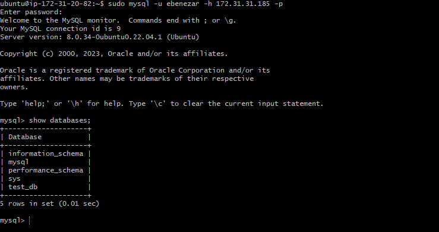

# Understanding Client Server Architecture

## Client Server Architecture with MySQL

Client server refers to architecture in which two or more computers are connected together over a network to send and receive requests between one another.

## Real example of LAMP website

Assuming that you go on your browser, and typed in there `www propitixhomes.com`, it means that your browser is considered the client. Essentially, it is sending request to the remote server, and in turn, would be expecting some kind of response from the remote server.

Lets take a very quick example and see the client-server communication in action.

Open up your Ubuntu or windows terminal and run `curl`command.

`curl -Iv www.propitixhomes.com`

**Note:** If your ubuntu or git bash does not have *"curl"* you can istall it by running `sudo apt install curl`.

In this example, your terminal will be the client while `www.propitixhomes.com `will be the **server**.

See the response from the remote server in below output. You can also see that the requests from the URL are been served by a computer with an IP address `75.2.115.196` on port `80`

Another simple way to get a server's IP address is to use a simple diagnostic tools like 'ping', it will also show round-trip time -time for packets to go to and back from server, this tool uses ICMP protocol.

# Implement a Client server Architecture using MySQL

## Database Management System (DBMS).

### TASK -Implement a Client Server Architecture using MySQL Database Management System (DBMS)

To demostrate a basic client-server using MySQL RDBMS, follow the below instruction.

1. Create and configure two linux based virtual servers (EC2 instances in AWS).

`Server A name -` `mysql-server`

`Server B name -` `mysql-client`

2. On `mysql server` Linux Server, install MySQL server software

**Interesting fact:** MySQL is an open source relational database management system. Its a combination of **"MY"**, the name of the co-founder *Michael Windenius's daughter* and, **"SQL"**, the abbreviation for **Structured Query Language.**

3. On `mysql client` Linux Server, install MySQL client software

4. By default, both of your EC2 virtual servers are located in the same local virtual network, so they can communicate to each other using **local IP addresses.** Use `mysql server's `local IP address to connect from `mysql client `. MySQL server uses TCP port 3306 by default, so you will have to open it by creating a new entry in inbound rules in mysql server Security Groups. For extral security, do not allow all IP addresses to reach your mysql server. Allow access only to the specific local IP address of your mysql client.

5. You might need to configure MySQL server to allow connections from remote hosts.

`sudo vi /etc/mysql/mysql.conf.d/mysqld.cnf `

Replace '127.0.0.1' to '0.0.0.0' like this:

6. From `mysql client` Linux Server connect remotely to `mysql server `Database Engine without using `SSH `. You must use the `mysql` utility to perform this action.

7. Check that you have successfully connected to a remote MySQL server and can perform SQL queries:

`Show databases;`

If you see an output similar to the below image then you have successfully completed this project. You have deployed a fully functional MySQL Client-Server set up. 

Congratulation!

