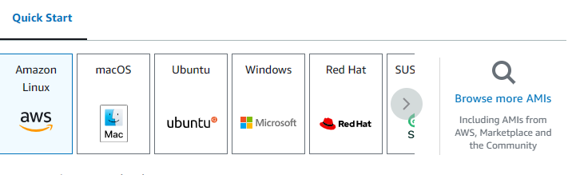
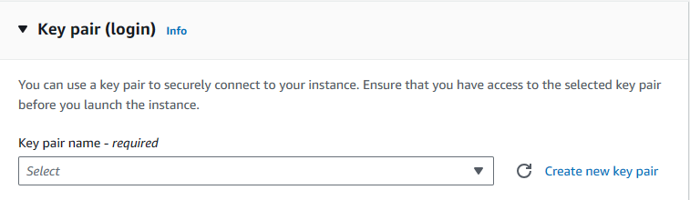
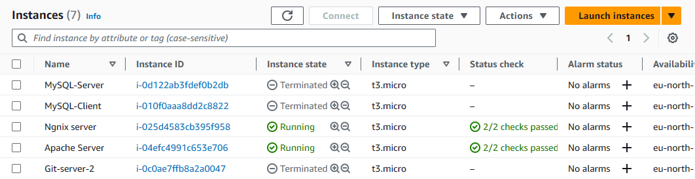
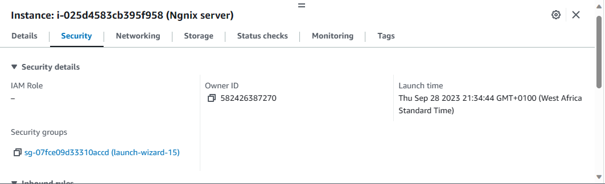
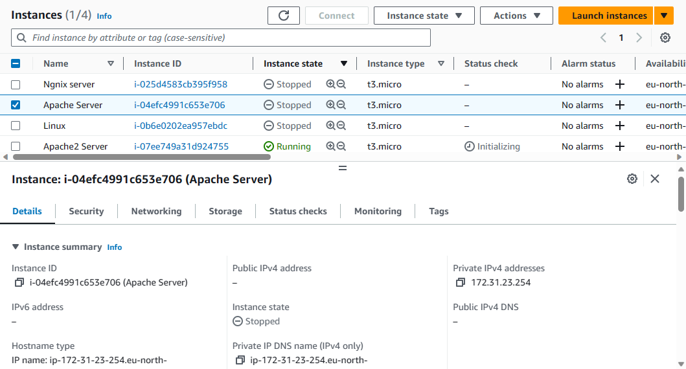
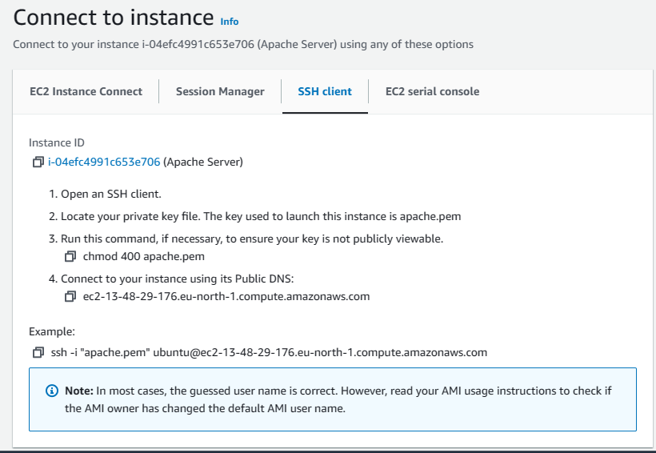
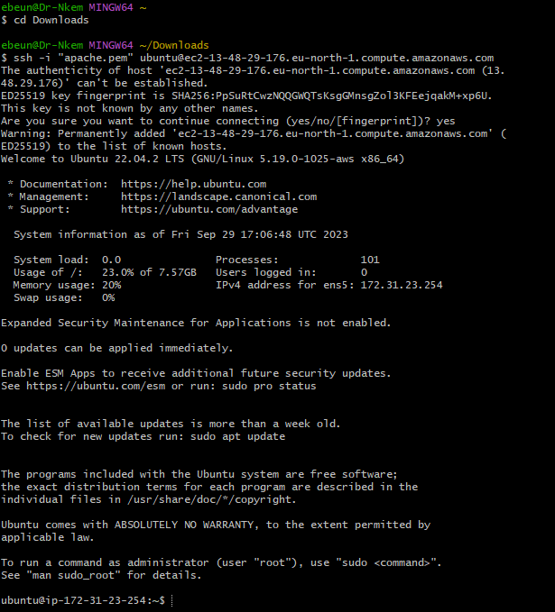
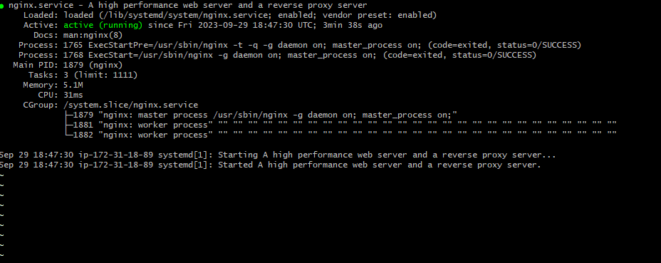
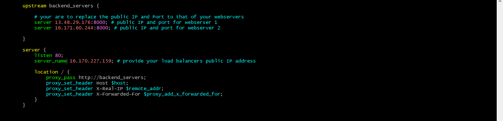
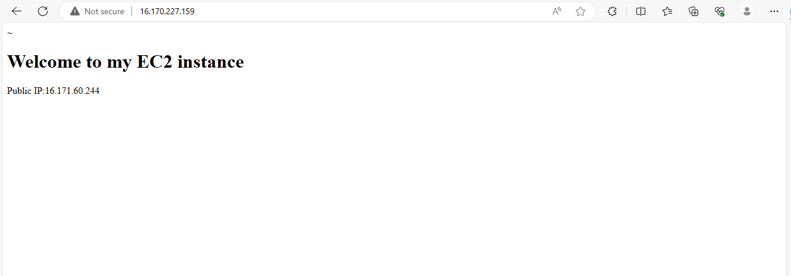

# IMPLEMENTING LOADBALANCER WITH NGNIX

## INTRODUCTION TO LOAD BALANCING AND NGINX

### Setting up a basic load balancer

We are going to be provisioning two EC2 instances running ubuntu 22.04 and install apache webserver in them. We will open port 8000 to allow traffic from anywhere, and finally update the default page of the webservers to display their public IP address.

Next, we will provision another EC2 instances running ubuntu 22.04, this time we will install Nginx and configure it to act as a load balancer distributing traffic accross the webservers.

**STEP 1:** Provisioning EC2 instance

 - Open your AWS Management console, click on EC2. Scroll down the page and click on launch instance.

 - Under name, provide a unique name for each of your webservers. Here, my first instance name is *Apache server* and my second instance name is *Apache2 server*.

 

 - Under application and OS images, click on quick start and click on ubuntu.

 

 - Under keypair, click on create new keypair if you do not have one. You can use thesame keypair for all the instances you provision for this lesson.

- And finally, click on launch instance.

 

 **STEP 2:** Open port 8000 we will be running our webservers on port 8000 while the load balancers runs on port 80. We need to open port 8000 to allow traffic from anywhere. To do this we need to add a rule to the security group of each of our webservers,

 - Click on the instance ID to get the details of your EC2 instance.

 

 - On the same page, scroll down and click on security

 

- On the top of the page click on security group and Select Edit inbound rules

- Add your rule

- Click on save rules

**STEP 3:** Install Apache Webserver

After provisioning both of our servers and have opened the necessary ports, its time to install apache software on both servers. To do so, we must first connect to each of the webserver via ssh. Then we can now run commands on the terminal of our webservers.

- Connecting to the webserver: To connect to the webserver, click on your instance id, at the top of the page, click on connect.

- Next go to SSH Client and copy the ssh command in the *example* below:

- Open a terminal in your local machine, cd into your Downloads folder. Paste the ssh command you copied in the previous step.

- Click on enter and type yes when prompted. You should be connected to a terminal on your instance.

- Next install apache with the command below

`sudo apt update -y &&  sudo apt install apache2 -y`

- Verify that apache is running using the command below

`sudo systemctl status apache2`

**STEP 4:** Configure Apache to server a page showing its public IP:

We will start by configuring **Apache** webserver to serve content on port 8000 instead of its default which is port 80. Then we will create a new **index.html** file. The file will contain code to display the public IP of the EC2 instance. We will then override apache webservers default html file with our new file.

- Configuring Apache to serve content on port 8000:

1. Using your text editor (eg vi, nano) to open the file/etc/apache2/ports.conf

`sudo vi /etc/apache2/ports.conf `

2. Add a new Listen directive for port 8000: First type **i** to switch the editor to insert mode. Then add the listen directive. Then save your file.

3. Next open the file /etc/apache2/site-available/000-default.conf and change port 80 on the virtual host to 8000 like the screenshot below:

`sudo vi /etc/apache2/sites-available/000-default.conf`

4. Close the file by first pressing the **esc** key on your keyboard then the command below:

`:wqa!`

5. Restart apache to load the new configuration using the command below:

`sudo systemctl restart apache2`

- Creating our new html file:

1. Open a new **index.html file with the command below:

`sudo vi index.html`

2. Switch vi editor to insert mode and paste the html file below. Before pasting the html file, get the public IP of your EC2 instance from AWS Management Console and replace the placeholder text for IP address in the html file.

 `<!DOCTYPE html>`

` <html>`

`<head>`

 ` <title>My EC2 Instance</title>`

`</head>`

 `<body>`

` <h1>Welcome to my EC2 instance</h1>`

` 
Public IP: YOUR_PUBLIC_IP
`

 `</body>`

` </html>`

3. Change file ownership of the index.html file with the command below:

`sudo chown www-data:www-data ./index.html`

- Overriding the default html file of Apache Webserver:

1. Replace the default html file with our new html file using the command below:

`sudo cp -f ./index.html /var/www/html/index.html`

2. Restart the webserver to load the new configuration using the command below:

`sudo systemctl restart apache2`

3. You should find a page on the browser like so:

**STEP 5:** Configure Hginx as a load balancer

- Provision anew EC2 instance running ubuntu 22.04. Make sure port 80 is opened to accept traffic from everywhere. You can refer **step 1** through **step 2** to refresh if needed.

- Next SSH into the instance. Again refer to **step 3** for a refresher if needed

- Install Nginx into the instance using the command below:

`sudo apt update -y && sudo apt install nginx -y`

- Verify that Nginx is installed with the command below:

`sudo systemctl status nginx`

- Open Nginx configuration file with the command below:

`sudo vi /etc/nginx/conf.d/loadbalancer.conf`

- Paste the configuration file below to configure nginx to act like a load balancer. A screenshot of an example config file is shown below: Make sure you edit the file and provide necessary information like your server IP address etc.

    

    **Upstream backend_servers** defines a group of backend servers. The server lines inside the **Upstream** block list the addresses and ports of your backend servers. **Proxy_pass** inside the **location** block sets up the load balancing, passing the requests to the backend servers. The **proxy_set_headers** lines pass necessary headers to the backend servers to correctly handles the requests.

    - Test your configuration with the command below:

    `sudo nginx -t`

    

    - If there are no errors, restart Nginx to load the new configuration with the command below:

   ` sudo systemctl restart nginx`

   - Paste the public IP address of Nginx load balancer, you should see the same webpages served by the webservers.

   

 

