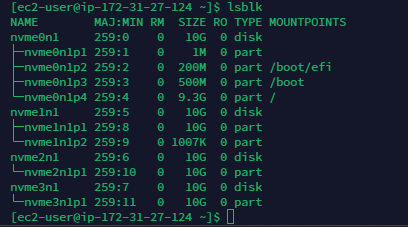

By the end of this course, you will have the necessary knowledge and skills to sucessfully implement and manage a WordPress website on AWS EC2 using LVM storage management. Whether you are a web developer, system administrator, or aspiring AWS DevOps professional, this course will empower you to leverage the power of AWS cloud infrastructure to build scalable and reliable WordPress sites. Join us on this transformative journey into the world of WordPress and AWS EC2, and unlock the potential to create and manage dynamic websites with confidence.

# Understanding 3 Tier Architecture

## Web Solution with WordPress

You are progressing in practicing to implement web solutions using different tecnologies. As a Devops engineer, you will most probably encounter PHP-based solution since, even in 2021, it is the dominant web programming language used by more websites than any other programming language.

In this project you will be tasked to prepare storage infrastructure on Linux servers and implement a basic web solution using **WordPress.** WordPress is a free and open-source content management system written in **PHP** and paired with **MySQL** or **MariaDB** as its backend Relational Database Management System (RDBMS)

This project consist of two parts:

1. Configure storage subsystem for Web and database servers based on linux OS. The focus of this part is to give you practical experience of working with disks, partitions and volumes in Linux.

2. Install WordPress and connect it to a remote MySQL database server. This part of the project will solidify your skills of deploying Web and DB tiers of Web solution.

As a DevOps engineer, your deep understanding of core components of web solutions and ability to troubleshoot them will play essential role in your future progress and development.

## Three-tier Architecture

Generally, web, or mobile solutions are implemented based on what is called the **Three-tier-Architecture.**

**Three-tier-Architecture** is a client-server software architecture pattern that compromise three seperate layers: 

1. **Presentation Layer (PL):** This is the user interface such as the client server or browser on your laptop.

2. **Business Layer (BL):** This is the backend programe that implements business logic Application or Webserver.

3. **Data access or Management Layer (DaL):** This is the layer for computer data storage and data access. **Database Server** or file System server such as **FTP Server**, or **NFS Server**

In this project, you will have the hands-on experience that showcases **Three-tier Architecture** while also ensuring that the disks used to store files on the Linux servers are adequately partitioned and managed through programs such as **gdisk** and **LVM** respectively.

Your 3-tiers Setup

1. A Laptop or PC to serve as a client

2. An EC2 Linux Server as a web server (This is where you will install Wordpress)

3. An EC2 Linux server as a database (DB) server.

*Use REDHAT OS for this project.* 

By Now you should know how to spin up an EC2 instance on AWS, but if you forgot, -refer **Project 1 Step 0.** In Previous projects we used Ubuntu, but it is better to be well-versed with various Linux distribution, thus, for this projects we will use very popular distribution called **REDHAT** (It also has a fully compatible derivative -**CentOS**)

**NOTE:** For Ubuntu server, when connecting to it via SSH/Putty or any other tool, we used **ubuntu** user, but for RedHat you will need to use **ec2-user** user. Connecting string will look like **ec2-user@<Public.IP>.

Let us get started!

## Implementing LVM on Linux servers (Web and database servers)

**Step1 - Prepare a Web Server**

1. Launch an EC2 instance that will serve as "Web server". Create 3 volume in thesame AZ as your Web Server EC2, each of 10GIB.

2. Attach all three volumes one by one to your Web Server EC2 instance.

3. Open up the Linux terminal to begin configuration

4. Use `lsblk` command to inspect what block devices are attached to the server. Notice names of your newly created devices. All devices in Linux reside in /dev/ directory. Inspect it with `ls /dev/` and make sure you see all 3 newly created block devices there -their names will likely be `nvme1n1`, `nvme2n1`, `nvme3n1`. 

5. Use `df -h` command to see all mounts and free space on your server

6. Use `gdisk` utility to create a single partition on each of the 3 disks

`sudo gdisk /dev/nvme1n1`

7. Use `lsblk` utility to view the newly configured partition on each of the 3 disks.

8. Install `lvm2` package using `sudo yum install lvm2`. Run `sudo lvmdiskscan` command to check for available partitions.

**Note:** Previously, in Ubuntu we usea `apt` command to install packages, in RedHat/CentOS a different package manager is used, so we shall use `yum` command instead.

9. Use `pvcreate` utility to mark each of 3 disks as physical volumes (PVs) to be used by LVM.

`sudo pvcreate /dev/nvme1n1p1`

`sudo pvcreate /dev/nvme2n1p1`

`sudo pvcreate /dev/nvme3n1p1`

10. Verify that your physical volume has been created sucessfully by running `sudo pvs`

11. Use `vgcreate` utility to add all 3 PVs to a volume group (VG). Name the VG **webdata-vg**

`sudo vgcreate webdata-vg /dev/nvme1n1p1 /dev/nvme2n1p1 /dev/nvme3n1p1`

12. Verify that your VG has been created sucessfully by running `sudo vgs`

13. Use `lvcreate` utility to create 2 logical volumes. **apps-lv *(Use half of the PV size),* and logs-lv *(Use the remaining space of the PV size).* NOTE:** apps-lv will be used to store data for the website while, logs-lv will be used to store data for logs.

`sudo lvcreate -n apps-lv -L 14G webdata-vg`

`sudo lvcreate -n logs-lv -L 14G webdata-vg`

14. Verify that your Logical Volume has been created sucessfully by running `sudo lvs`

15. Verify the entire setup

`sudo vgdisplay -v #view complete setup - VG, PV, and LV`

`sudo lsblk` 

16. Use `mkfs.ext4` to format the logical volumes with ext4 filesystem

`sudo mkfs -t ext4 /dev/webdata-vg/apps-lv`

`sudo mkfs -t ext4 /dev/webdata-vg/logs-lv`

17. Create **/var/www/html** directory to store website files

`sudo mkdir -p /var/www/html`

18. Create **/home/recovery/logs** to store backup of log data

`sudo mkdir -p /home/recovery/logs`

19. Mount **/var/www/html on apps-lv** logical volume.

`sudo mount /dev/webdata-vg/apps-lv /var/www/html/`

20. Use `rsync` utility to backup all the files in the log directory **/var/log** into **/home/recovery/logs** *(This is required before mounting the file system)*

`sudo rsync -av /var/log/. /home/recovery/logs/`

21. Mount **/var/log** on **logs-lv** logical volume. *(Note that all the existing data on /var/log will be deleted. That is why step 17 above is very important)*

`sudo mount /dev/webdata-vg/logs-lv /var/log`

22. Restore log files back into **/var/log** directory

`sudo rsync -av /home/recovery/logs/log/. /var/log`

23. Update `/etc/fstab` file so that the mount configuration will persist after restart of the server.

The UUID of the device will be used to update the `/etc/fstab` file;

`sudo blkid`

sudo vi `/etc/fstab`

Update `/etc/fstab` in this format using your own UUID and remember to remove the leading and ending quotes.

24. Test the configuration and reload the daemon

`sudo mount -a`

`sudo systemctl daemon-reload`

25. Verify your setup by running `df -h` output must look like this:

## Installing wordpress and configurind to use MySQL Datebase.

### Step 2 - Prepare the Database Server

Launch a second RedHat EC2 instance that will have a role -DB server, Repeat the same steps as for the webserver, but instaed of `app-lv` and mount it to `/bd` directory instead of `/var/www/html`

### Step 3 -Install Wordpress on your Web Server EC2

1. Update the repository

`sudo yum -y update`

2. Install wget, Apache and its dependencies

`sudo yum -y install wget httpd php php-mysqlnd php-fpm php-json`

3. Start Apache

`sudo systemctl enable httpd`

`sudo systemctl start httpd`

4. To install PHP and its dependencies

`sudo yum install https://dl.fedoraproject.org/pub/epel/epel-release-latest-9.noarch.rpm`

`sudo yum install yum-utils http://rpms.remirepo.net/enterprise/remi-release-9.rpm`

`sudo yum module list php`

`sudo yum module reset php`

`sudo yum module enable php:remi-7.4`

`sudo yum install php php-opcache php-gd php-curl php-mysqlnd`

`sudo systemctl start php-fpm`

`sudo systemctl enable php-fpm`

`setsebool -P httpd_execmem 1`

5. Restart Apache

`sudo systemctl restart httpd`

6. Download wordpress and copy wordpress to `var/www/html`

`mkdir wordpress`

`cd   wordpress`

`sudo wget http://wordpress.org/latest.tar.gz`

`sudo tar xzvf latest.tar.gz`

`sudo rm -rf latest.tar.gz`

`cp wordpress/wp-config-sample.php wordpress/wp-config.php`

`cp -R wordpress /var/www/html/`

7. Configure SELinux Policies

 `sudo chown -R apache:apache /var/www/html/wordpress`

` sudo chcon -t httpd_sys_rw_content_t /var/www/html/wordpress -R`

 `sudo setsebool -P httpd_can_network_connect=1`

 ### Step 4 -Install MYSQL on your DB Server EC2

` sudo yum update`

`sudo yum install mysql-server`

Verify that the service is up and running by using `sudo systemctl status mysqld`, if it is not running, restart the service and enable it so it will be running even after roboot:

`sudo systemctl restart mysqld`

`sudo systemctl enable mysqld`
 
 ### Step 5 - Configure DB to work with wordpress

` sudo mysql`

`CREATE DATABASE wordpress;`

`CREATE USER `myuser`@`<Web-Server-Private-IP-Address>` IDENTIFIED BY 'mypass';`

`GRANT ALL ON wordpress.* TO 'myuser'@'<Web-Server-Private-IP-Address>';
FLUSH PRIVILEGES;`

`SHOW DATABASES;`

`exit`

### Step 6 -Configure Wordpress to connect to remote database.

**Hints:** Do not forget to open MySQL port 3306 on DB Server EC2. For extra security, you shall allow access to the DB server **ONLY** from your Web Server.s IP address, so in the Inbound Rule configuration specify source as /32
 **Note:** My database MySQL server security port is opened for all traffic

 
 1. Install MySQL client and test that you can connect from your webserver to your DB server by using `mysql-client`

 `sudo yum install mysql`

`sudo mysql -u admin -p -h <DB-Server-Private-IP-address>`
enable 
2. Verify if you can sucessfully execute `SHOW DATABASES;` command and see a list of existing databases

3. Change permission and configuration so Apache could use WordPress: 

4. Enable TCP port 80 in Inbound Rules configuration for your Web Server EC2 (enable from everywhere 0.0.0.0/0 or from your workstation's IP)

5. Try to access from your browser the link to your WordPress `http://<web-server-Public-IP-Address>/wordpress/`

Congratulations

